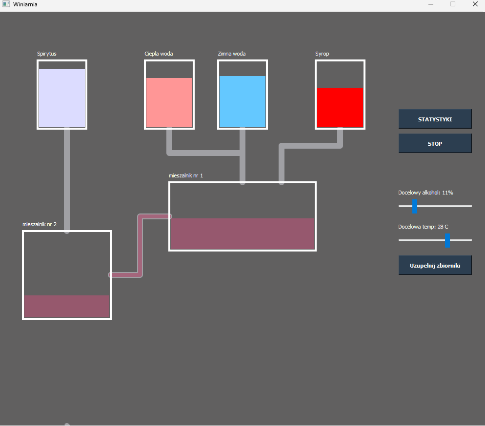
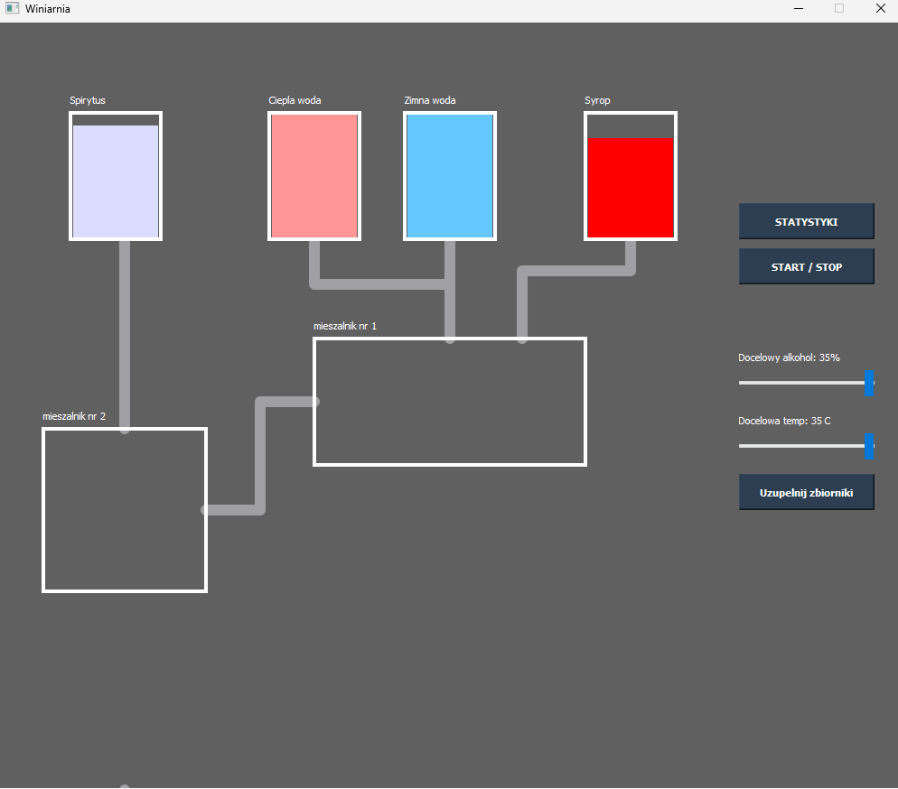
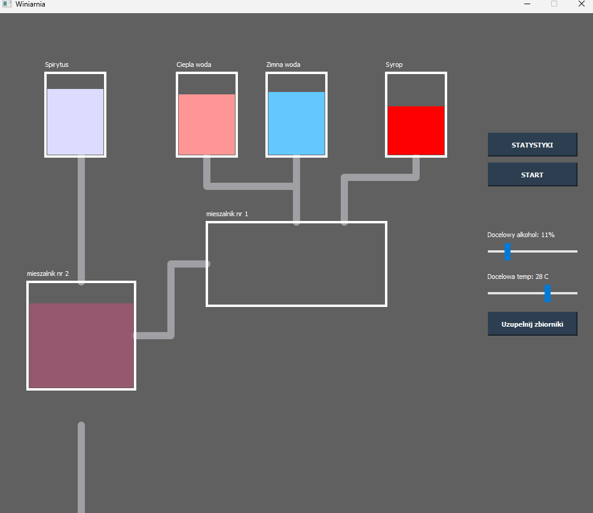
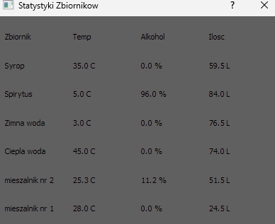

***Tytuł:*** Winiarnia SCADA  
***Autor:*** Maciej Pawłowski  

Projekt został zrealizowany z udziałem biblioteki PyQt5  

***Dodatkowe elementy:***  
-dynamicznie zmieniający się kolor cieczy podczas łączenia różnych zbiorników  
-okno diagnostyczne zawierające wartości o temperaturze, ilości cieczy oraz % alkoholu w zbiorniku  
-dynamicznie wysuwająca się rura do opróżniana zbiornika  
-zmiana temperatur i stężenia alkoholu w cieczach podczas mieszania  

***Przyciski/suwaki:***  
STATYSTYKI-wyświetla okno diagnostyczne zawierające szczegółowe informacje o wartości cieczy w danym zbiorniku  
START/STOP-uruchamianie się automatycznego procesu tworzenia wina  
UZUPEŁNIJ ZBIORNIKI-uzupelnia zbiorniki z syropem, spirytusem, zimną wodą oraz ciepła o pseudolosowe wartości temperatury, oraz % alkoholu według określonego zakresu.  

DOCELOWY ALK (suwak) - regulacja finalnego stężenia alkoholu w winie, regulacja od 5% do 35%  
DOCELOWA TEMP (suwak) - regulacja temperatury soku (sok = syrop + ciepła/zimna woda), regulacja od 13 C do 35 C  

***Logika działania:***  
Po kliknięciu start następuje wlanie 20L syropu do mieszalnika nr 1, następnie dolewając zimną/cieplą wode zbiornik jest uzupełniany do 70L, zachowując temperaturę podana przez użytkownika.
Po tym procesie sok z mieszalnika nr 1 wędruje do mieszalnika nr 2, do którego również jednocześnie trafia spirytus. Proces ten wykonywany jest do przelania całego mieszalnika nr 1 oraz dolania takiej ilości spirytusu, aby spełniała wartość podana przez użytkownika.  

***Zdjecia z programu:***  
  
  
  
  

